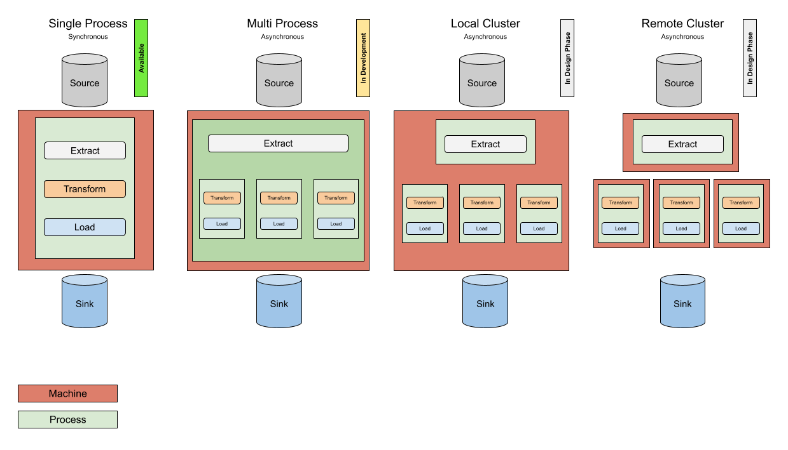

# ETL - Asynchronous Pipeline

This repository provides an abstraction for [asynchronous processing](https://github.com/flow-php/etl/discussions/129) for Flow, PHP ETL.

## Processing Modes

The goal is to make following processing modes available.

* Single Process - [[flow-php/etl](https://github.com/flow-php/etl)]
* Multi Process - [[flow-php/etl](https://github.com/flow-php/etl), [flow-php/etl-async](https://github.com/flow-php/etl-async)]
* Local Cluster - [[flow-php/etl](https://github.com/flow-php/etl), [flow-php/etl-async](https://github.com/flow-php/etl-async), ...]
* Remote Cluster - [[flow-php/etl](https://github.com/flow-php/etl), [flow-php/etl-async](https://github.com/flow-php/etl-async), ...]

